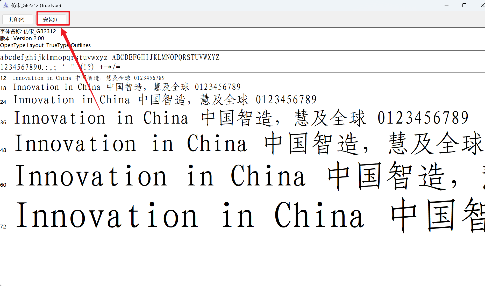
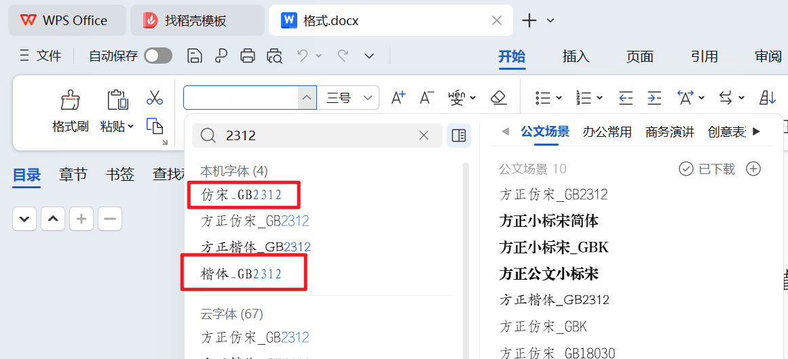
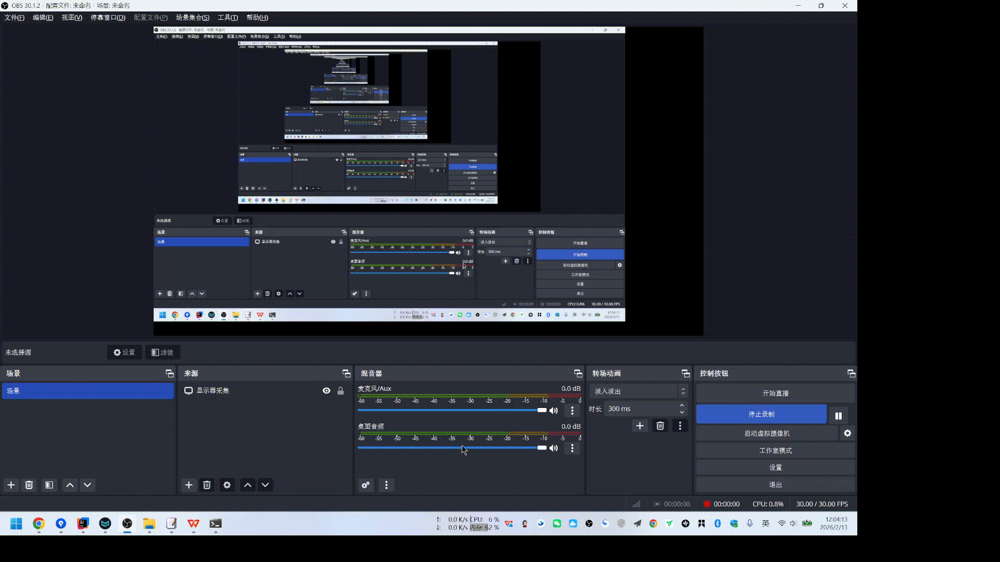

# Word格式化工具（GB/T 9704-2012）

# 一、工具简介

便捷的Word文档格式化工具，严格遵循GB/T 9704-2012标准，可快速完成文档格式标准化设置，无需手动逐一调整。

**全程本地运行，无文档内容泄露风险。**

# 二、使用方法

## （一）导入缺失字体

### 1.双击字体ttf文件，点击「安装」即可（见下图）：

### 2.字体资源：存放在[国标及字体](%E5%9B%BD%E6%A0%87%E5%8F%8A%E5%AD%97%E4%BD%93)目录下，包含：

#### （1）[楷体_GB2312.ttf](国标及字体/%E6%A5%B7%E4%BD%93_GB2312.ttf)

#### （2）[仿宋_GB2312.ttf](国标及字体/%E4%BB%BF%E5%AE%8B_GB2312.ttf)

### 3.导入效果：WPS中可查看本机已安装楷体_GB2312、仿宋_GB2312字体

## （二）添加脚本

### 1.打开WPS → 工具 → 开发工具 → 切换至VB环境 → 查看代码 → 右击Normal → 插入 → 模块

### 2.复制脚本[Format2GBT9704_2012.txt](Format2GBT9704_2012.txt)中的内容，粘贴至模块1，关闭窗口即可。

## （三）使用脚本

### 1.打开WPS → 工具 → 运行宏 → 选择「Format2GBT9704_2012」→ 点击运行

### 2.运行成功后，将弹出「格式化完成」提示。

# 三、可格式化具体内容

## （一）页面设置

### 1.页边距：上3.7cm、下3.5cm、左2.7cm、右2.7cm

### 2.行距：固定值28磅

## （一）格式标准

### 1.标题：方正小标宋简体 二号，标题后空一行

### 2.一级标题：黑体 三号，缩进2字符，层次序数使用“一、二、三、四、五、六、七、八、九、十”

### 3.二级标题：楷体_GB2312 三号，缩进2字符，层次序数使用“（一）（二）（三）（四）（五）（六）（七）（八）（九）（十）”

### 4.三级标题：仿宋_GB2312 三号，缩进2字符，层次序数使用“1.2.3.4.5.6.7.8.9.10.”

### 5.四级标题：仿宋_GB2312 三号，缩进2字符，层次序数使用“(1)(2)(3)(4)(5)(6)(7)(8)(9)(10)”

### 6.正文：仿宋_GB2312 三号，首行缩进2字符

### 7.数字：Times New Roman字体