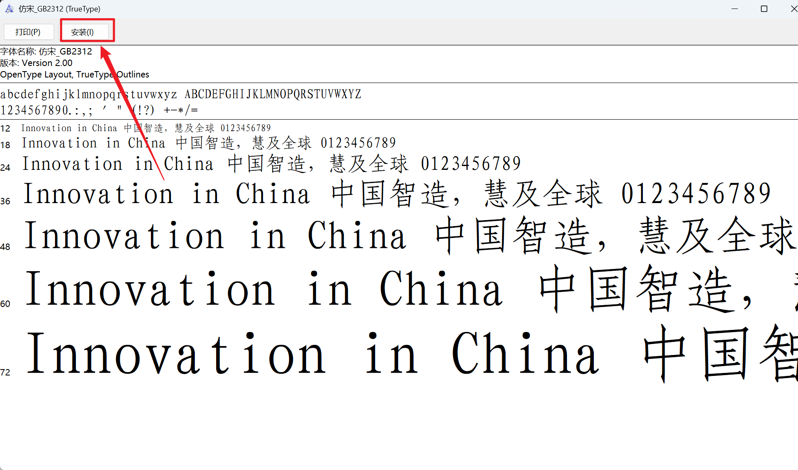
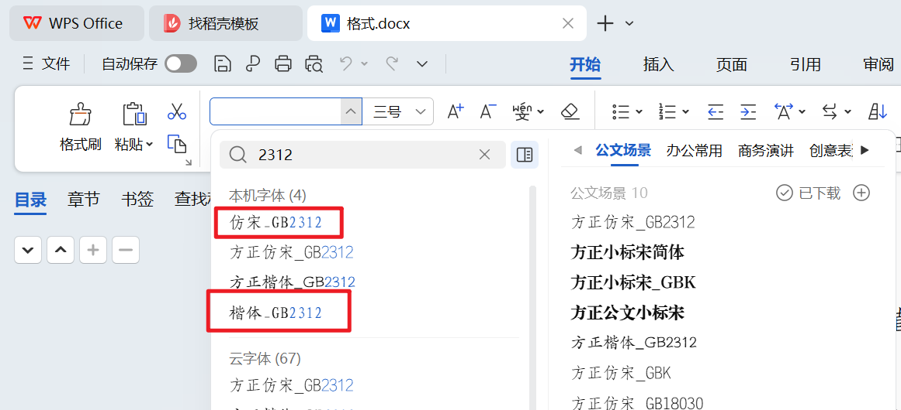
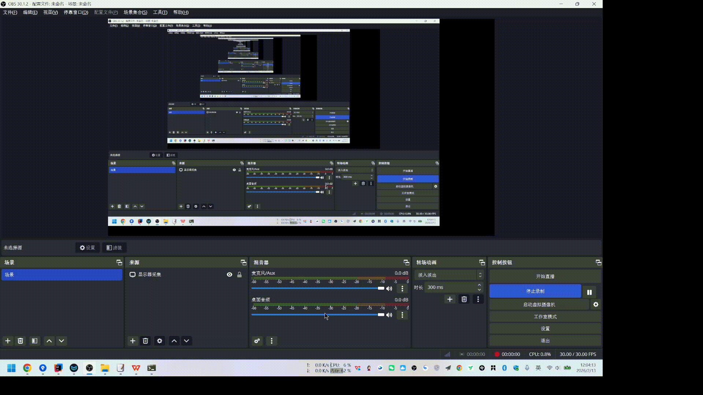

# Word格式化工具（GB/T 9704-2012）

# 一、工具简介

便捷的Word文档格式化工具，严格遵循GB/T 9704-2012标准，可快速完成文档格式标准化设置，无需手动逐一调整。

**全程本地运行，无文档内容泄露风险。**

# 二、使用方法

## （一）导入缺失字体

### 1.安装字体
双击字体ttf文件，点击「安装」即可（见下图）：

### 2.字体资源
存放在[国标及字体](%E5%9B%BD%E6%A0%87%E5%8F%8A%E5%AD%97%E4%BD%93)目录下，包含：

#### （1）[GBT 9704-2012公文格式.pdf](%E5%9B%BD%E6%A0%87%E5%8F%8A%E5%AD%97%E4%BD%93/GBT%209704-2012%E5%85%AC%E6%96%87%E6%A0%BC%E5%BC%8F.pdf)

#### （2）[Times New Roman.ttf](%E5%9B%BD%E6%A0%87%E5%8F%8A%E5%AD%97%E4%BD%93/Times%20New%20Roman.ttf)

#### （3）[仿宋_GB2312.ttf](%E5%9B%BD%E6%A0%87%E5%8F%8A%E5%AD%97%E4%BD%93/%E4%BB%BF%E5%AE%8B_GB2312.ttf)

#### （4）[方正小标宋简体.ttf](%E5%9B%BD%E6%A0%87%E5%8F%8A%E5%AD%97%E4%BD%93/%E6%96%B9%E6%AD%A3%E5%B0%8F%E6%A0%87%E5%AE%8B%E7%AE%80%E4%BD%93.ttf)

#### （5）[楷体_GB2312.ttf](%E5%9B%BD%E6%A0%87%E5%8F%8A%E5%AD%97%E4%BD%93/%E6%A5%B7%E4%BD%93_GB2312.ttf)

#### （6）[黑体.ttf](%E5%9B%BD%E6%A0%87%E5%8F%8A%E5%AD%97%E4%BD%93/%E9%BB%91%E4%BD%93.ttf)

### 3.导入效果：
WPS中可查看本机已安装楷体_GB2312、仿宋_GB2312字体

## （二）添加脚本
wps可在VB环境或JS环境添加宏代码，以下2种环境选择一种进行添加即可。
### 1.VB环境
#### （1）创建模块
打开WPS → 工具 → 开发工具 → 切换至VB环境 → 查看代码 → 右击Normal → 插入 → 模块

#### （2）复制脚本
复制脚本[Format2GBT9704_2012.bas](Format2GBT9704_2012.bas)中的内容，粘贴至模块1，关闭窗口即可。
### 2.JS环境
#### （1）创建模块
打开WPS → 工具 → 开发工具 → 切换至JS环境 → 查看代码 → 右击Project(Normal.dotm) → 插入 → 模块

#### （2）复制脚本
复制脚本[Format2GBT9704_2012.js](Format2GBT9704_2012.js)中的内容，粘贴至Module1，关闭窗口即可。

## （三）使用脚本

### 1.运行宏脚本
打开WPS → 工具 → 运行宏 → 选择「Format2GBT9704_2012」→ 点击运行

### 2.成功提示
运行成功后，将弹出「文档已按照GB/T 9704-2012格式化完成。」提示。

# 三、可格式化具体内容

## （一）页面设置

### 1.页边距
上3.7cm、下3.5cm、左2.7cm、右2.7cm

### 2.行距
固定值28磅

### 3.页码
奇数页码居右，偶数页码居左，采用 4 号宋体阿拉伯数字

## （一）格式标准

### 1.标题
方正小标宋简体 二号，标题后空一行

### 2.一级标题
黑体 三号，缩进2字符，层次序数使用“一、二、三、四、五、六、七、八、九、十”

### 3.二级标题
楷体_GB2312 三号，缩进2字符，层次序数使用“（一）（二）（三）（四）（五）（六）（七）（八）（九）（十）”

### 4.三级标题
仿宋_GB2312 三号，缩进2字符，层次序数使用“1.2.3.4.5.6.7.8.9.10.”，并加粗

### 5.四级标题
仿宋_GB2312 三号，缩进2字符，层次序数使用“（1）（2）（3）（4）（5）（6）（7）（8）（9）（10）”，并加粗

### 6.其他加粗
“一是、二是” 等表述统一加粗

### 7.正文
仿宋_GB2312 三号，首行缩进2字符

### 8.数字
Times New Roman字体